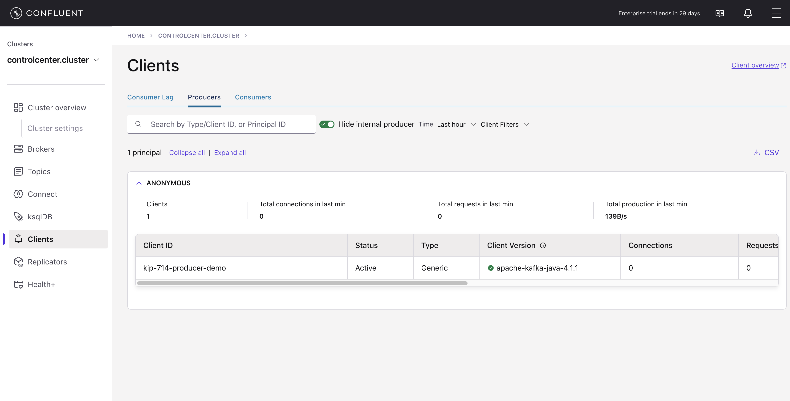
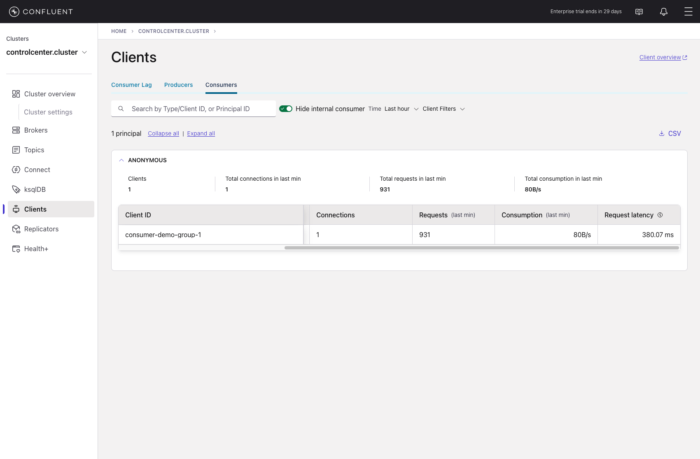
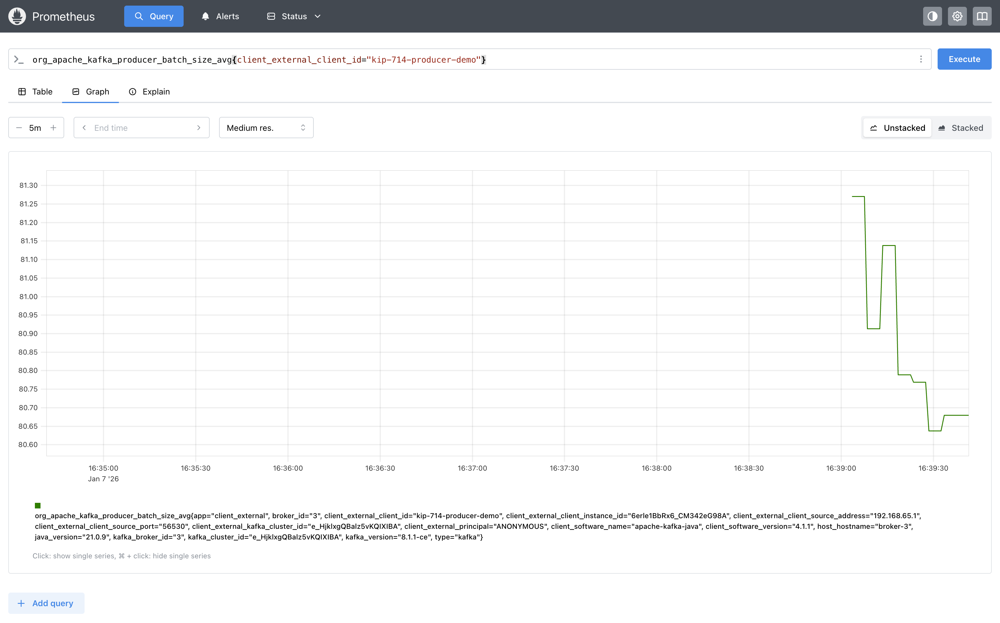
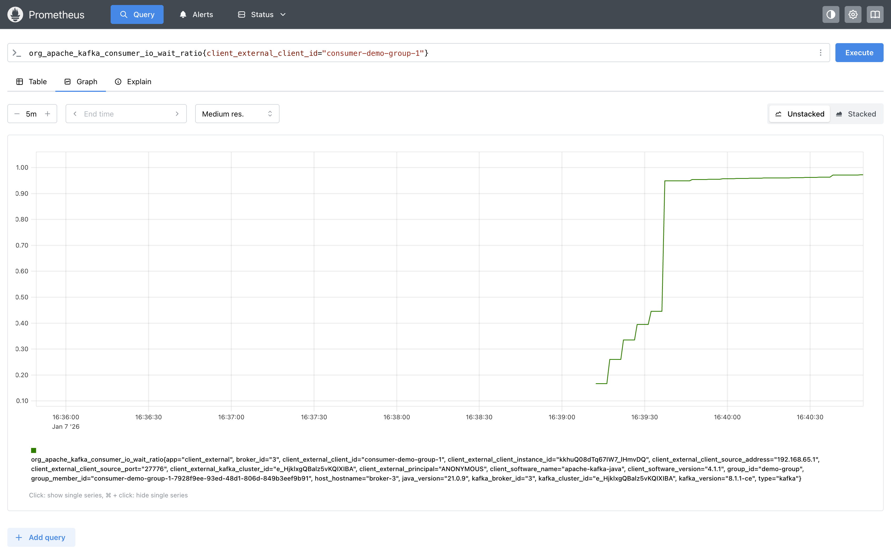
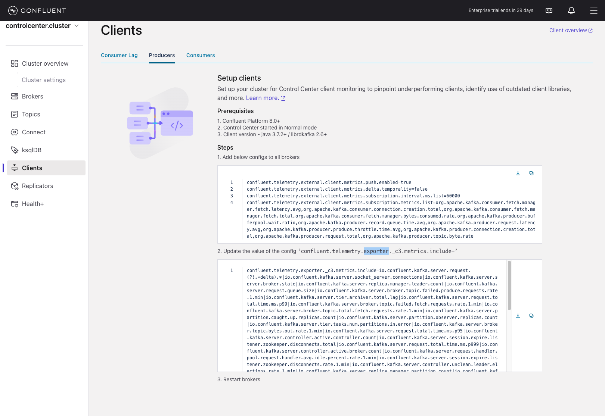

# Exploration of KIP-714

This work is based on https://github.com/Acquitrino/kip-714 and https://github.com/rjmfernandes/kip714

[KIP-714](https://cwiki.apache.org/confluence/display/KAFKA/KIP-714%3A+Client+metrics+and+observability) aims to improve monitoring and troubleshooting of Kafka clients by giving operators visibility into client behavior — without requiring changes to application code. Before this KIP, client-internal metrics were hard to collect centrally, making it difficult to diagnose issues like queue buildup, internal latencies, or processing failures from the broker’s perspective.

## Disclaimer

The code and/or instructions here available are **NOT** intended for production usage.
It's only meant to serve as an example or reference and does not replace the need to follow actual and official documentation of referenced products.

## Prerequisites

- **Docker**: To run the Kafka cluster and observability stack.
- **Java 21**: To compile and run the Kafka clients.
- **Maven 3.8+**: To build the project.

## Quick Start

### 1. Start the Environment

Start the Docker Compose services, which include 3 Kafka Brokers, Confluent Control Center, Prometheus, Alertmanager, and an OpenTelemetry Collector.

```bash
docker compose up -d
```

### 2. Build the Kafka Clients

Navigate to the `kafka-clients` directory and build the project.

```bash
cd kafka-clients
mvn clean compile package
```

### 3. Run the Producer

Run the producer application. By default, it produces alphanumeric strings to the `test-queues` topic using the client ID `kip-714-producer-demo`.

```bash
mvn exec:java@run-producer
```

**Custom Parameters:**

You can optionally specify the **Topic Name** and **Client ID** as command-line arguments:

```bash
mvn exec:java@run-producer -Dexec.args="<topic_name> <client_id>"
```

**Example:**

```bash
mvn exec:java@run-producer -Dexec.args="my-topic my-custom-client-id"
```

- **Argument 1 (`topic_name`)**: The topic to produce to (Default: `test-queues`).
- **Argument 2 (`client_id`)**: The client ID for the producer (Default: `kip-714-producer-demo`).

### 4. Run the Consumer

Open a new terminal, navigate to `kafka-clients`, and run the consumer application.

```bash
mvn exec:java@run-consumer
```

**Custom Parameters:**

You can optionally specify the **Group ID** as a command-line argument:

```bash
mvn exec:java@run-consumer -Dexec.args="<group_id>"
```

**Example:**

```bash
mvn exec:java@run-consumer -Dexec.args="my-custom-group"
```

- **Argument 1 (`group_id`)**: The consumer group ID (Default: `demo-group`).

## Observability

Once the clients are running, you can explore the metrics generated by KIP-714.

### Control Center

Open Confluent Control Center at [http://localhost:9021](http://localhost:9021).
1.  Navigate to the cluster.
2.  Click on the **Clients** tab in the left-hand menu.
3.  You will see a list of connected clients (e.g., `kip-714-producer-demo`, `consumer-demo-group-1`).
4.  Click on a client ID to view its specific metrics dashboard.

**Producer in Control Center:**


**Consumer in Control Center:**


### Prometheus

For advanced analysis and access to metrics not visible in Control Center, you can query Prometheus directly at [http://localhost:9090](http://localhost:9090).

**Why use Prometheus?**
While Control Center displays a curated set of 6 key metrics, KIP-714 exposes a vast array of internal client metrics. Prometheus allows you to query **any** of them.

**Query Examples:**

**1. Producer Batch Size Average**
View the average batch size for your specific producer:
[Click to Query](http://localhost:9090/query?g0.expr=org_apache_kafka_producer_batch_size_avg%7Bclient_external_client_id%3D%22kip-714-producer-demo%22%7D&g0.show_tree=0&g0.tab=graph&g0.range_input=5m&g0.res_type=auto&g0.res_density=medium&g0.display_mode=lines&g0.show_exemplars=0)

```prometheus
org_apache_kafka_producer_batch_size_avg{client_external_client_id="kip-714-producer-demo"}
```

**Producer Metric in Prometheus:**


**2. Consumer I/O Wait Ratio**
View the I/O wait ratio for your specific consumer group:
[Click to Query](http://localhost:9090/query?g0.expr=org_apache_kafka_consumer_io_wait_ratio%7Bclient_external_client_id%3D%22consumer-demo-group-1%22%7D&g0.show_tree=0&g0.tab=graph&g0.range_input=5m&g0.res_type=auto&g0.res_density=medium&g0.display_mode=lines&g0.show_exemplars=0)

```prometheus
org_apache_kafka_consumer_io_wait_ratio{client_external_client_id="consumer-demo-group-1"}
```

**Consumer Metric in Prometheus:**


## Configuration Notes

- **Control Center & External Metrics**: If `KAFKA_CONFLUENT_TELEMETRY_EXTERNAL_CLIENT_METRICS_PUSH_ENABLED` is set to `false`, Control Center will display a screen explaining the required parameters to use this functionality.
  

- **Metric Filtering**: Configuration of `KAFKA_CONFLUENT_TELEMETRY_EXPORTER_C3PLUSPLUS_METRICS_INCLUDE` as `(.)*` will move *all* Kafka broker MBeans and client subscriptions to Prometheus.
  > [!WARNING]
  > This setting (`(.)*`) is convenient for this demo environment but **should not be used in production**. It creates significant pressure on Prometheus. For production, explicitly select only the metrics you need to export.

## Cleanup

To stop the environment and remove volumes (resetting data):

```bash
docker compose down -v
```
