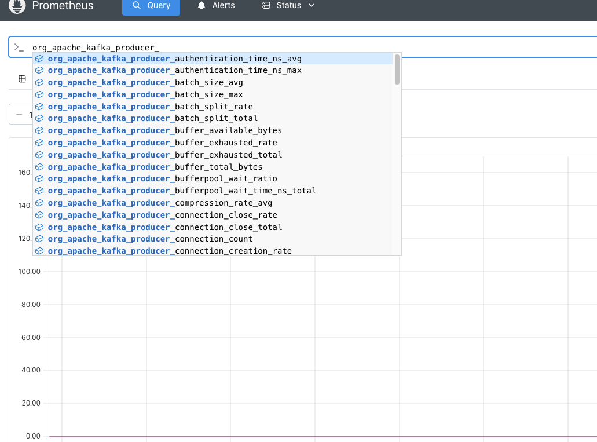
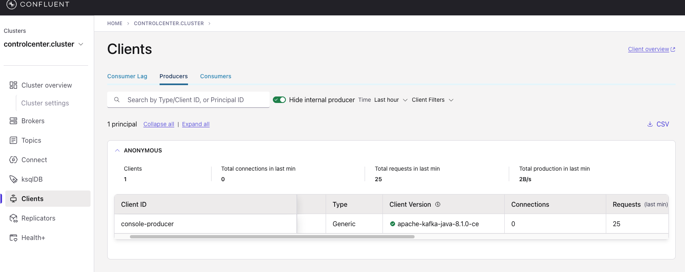
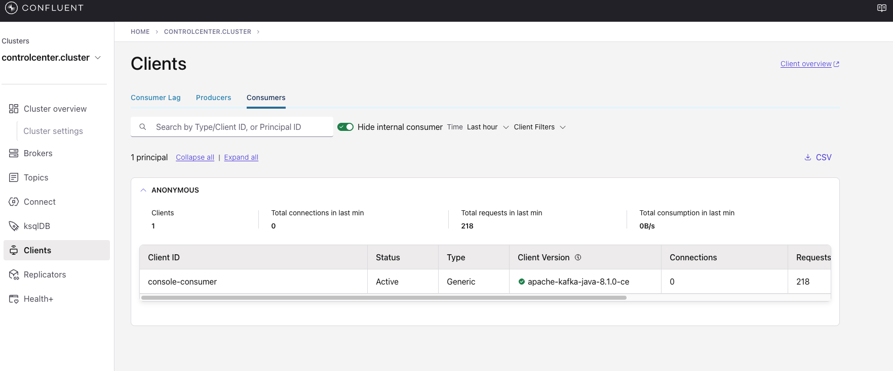
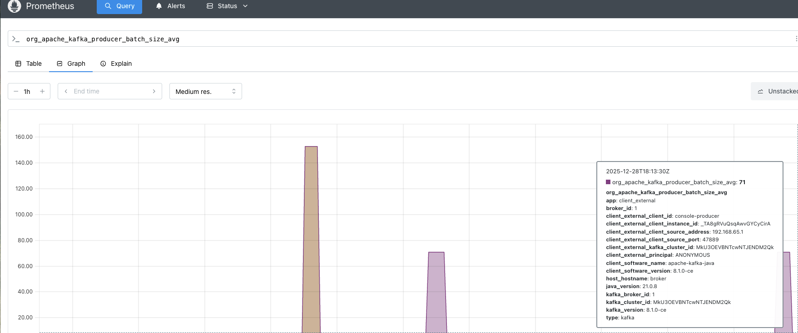

# Exploration of KIP-714 

This work is based on https://github.com/Acquitrino/kip-714 

[KIP-714](https://cwiki.apache.org/confluence/display/KAFKA/KIP-714%3A+Client+metrics+and+observability) aims to improve monitoring and troubleshooting of Kafka clients by giving operators visibility into client behavior — without requiring changes to application code. Before this KIP, client-internal metrics were hard to collect centrally, making it difficult to diagnose issues like queue buildup, internal latencies, or processing failures from the broker’s perspective.

- [Exploration of KIP-714](#exploration-of-kip-714)
  - [Disclaimer](#disclaimer)
  - [Setup](#setup)
    - [Start Docker Compose](#start-docker-compose)
    - [Check Control Center](#check-control-center)
  - [Requirements](#requirements)
  - [Major Configurations](#major-configurations)
  - [Kafka Client Metrics](#kafka-client-metrics)
  - [Prometheus metrics](#prometheus-metrics)
    - [Leveraging C3++ Prometheus](#leveraging-c3-prometheus)
  - [Kafka Clients](#kafka-clients)
  - [Cleanup](#cleanup)

## Disclaimer

The code and/or instructions here available are **NOT** intended for production usage. 
It's only meant to serve as an example or reference and does not replace the need to follow actual and official documentation of referenced products.

## Setup

### Start Docker Compose

```bash
docker compose up -d
```

### Check Control Center

Open http://localhost:9021 and check cluster is healthy including Kafka Connect.

## Requirements

- C3++ (Next Gen) is not required for KIP-714 (only Prometheus for the exposure)
- CP Minimal version 8.0.0
- C3++ Minimal version 2.3.0

## Major Configurations

A Subscription must be crated in order to instruct Kafka clients with the set of Metrics they should report and how often. You can also specify some filters on the clients who should be reporting into such Subscription (match config.)

- Enable the feature: KAFKA_CONFLUENT_TELEMETRY_EXTERNAL_CLIENT_METRICS_PUSH_ENABLED: "true"
- A Prometheus Compatibility config: KAFKA_CONFLUENT_TELEMETRY_EXTERNAL_CLIENT_METRICS_DELTA_TEMPORALITY: "false"
- How often clients should report the Metrics: KAFKA_CONFLUENT_TELEMETRY_EXTERNAL_CLIENT_METRICS_SUBSCRIPTION_INTERVAL_MS_LIST: "5000"
- Create a Telemetry Subscription including all the available client metrics (KIP-714) or the bare minimum required for C3: KAFKA_CONFLUENT_TELEMETRY_EXTERNAL_CLIENT_METRICS_SUBSCRIPTION_METRICS_LIST: "*"
- After metrics are reported by clients on the Broker side they need to be stored somewhere, that’s the role of the Metrics Plugin. For Confluent Platform the Metric Plugin is: KAFKA_METRIC_REPORTERS: io.confluent.telemetry.reporter.TelemetryReporter
- The Metrics Plugin must also be instructed with the set of Metrics that must be stored: KAFKA_CONFLUENT_TELEMETRY_EXPORTER_C3PLUSPLUS_METRICS_INCLUDE: "io.confluent.kafka.server.request.(?!.*delta).*|io.confluent.kafka.server.server.broker.state|io.confluent.kafka.server.replica.manager.leader.count|io.confluent.kafka.server.request.queue.size|io.confluent.kafka.server.broker.topic.failed.produce.requests.rate.1.min|io.confluent.kafka.server.tier.archiver.total.lag|io.confluent.kafka.server.request.total.time.ms.p99|io.confluent.kafka.server.broker.topic.failed.fetch.requests.rate.1.min|io.confluent.kafka.server.broker.topic.total.fetch.requests.rate.1.min|io.confluent.kafka.server.partition.caught.up.replicas.count|io.confluent.kafka.server.partition.observer.replicas.count|io.confluent.kafka.server.tier.tasks.num.partitions.in.error|io.confluent.kafka.server.broker.topic.bytes.out.rate.1.min|io.confluent.kafka.server.request.total.time.ms.p95|io.confluent.kafka.server.controller.active.controller.count|io.confluent.kafka.server.request.total.time.ms.p999|io.confluent.kafka.server.controller.active.broker.count|io.confluent.kafka.server.request.handler.pool.request.handler.avg.idle.percent.rate.1.min|io.confluent.kafka.server.controller.unclean.leader.elections.rate.1.min|io.confluent.kafka.server.replica.manager.partition.count|io.confluent.kafka.server.controller.unclean.leader.elections.total|io.confluent.kafka.server.partition.replicas.count|io.confluent.kafka.server.broker.topic.total.produce.requests.rate.1.min|io.confluent.kafka.server.controller.offline.partitions.count|io.confluent.kafka.server.socket.server.network.processor.avg.idle.percent|io.confluent.kafka.server.partition.under.replicated|io.confluent.kafka.server.log.log.start.offset|io.confluent.kafka.server.log.tier.size|io.confluent.kafka.server.log.size|io.confluent.kafka.server.tier.fetcher.bytes.fetched.total|io.confluent.kafka.server.request.total.time.ms.p50|io.confluent.kafka.server.tenant.consumer.lag.offsets|io.confluent.kafka.server.log.log.end.offset|io.confluent.kafka.server.broker.topic.bytes.in.rate.1.min|io.confluent.kafka.server.partition.under.min.isr|io.confluent.kafka.server.partition.in.sync.replicas.count|io.confluent.telemetry.http.exporter.batches.dropped|io.confluent.telemetry.http.exporter.items.total|io.confluent.telemetry.http.exporter.items.succeeded|io.confluent.telemetry.http.exporter.send.time.total.millis|io.confluent.kafka.server.controller.leader.election.rate.(?!.*delta).*|io.confluent.telemetry.http.exporter.batches.failed|org.apache.kafka.producer.*|org.apache.kafka.consumer.*"
(**Important Note**: * it’s not working … → FATAL ERROR: org.apache.kafka.common.config.ConfigException: Failed to create exporter config for exporter 'c3plusplus'. Reason: Metrics filter for configurationmetrics.include is not a valid regular expression)
- How often the Plugin will flush into Prometheus: KAFKA_CONFLUENT_TELEMETRY_METRICS_COLLECTOR_INTERVAL_MS: "60000"

## Kafka Client Metrics

```shell
kafka-client-metrics --bootstrap-server broker:9092 --list
```

You should get:

```
default-0
```

```shell
kafka-client-metrics --bootstrap-server broker:9092 --describe
```

You should get:

```
Client metrics configs for default-0 are:
  interval.ms=300000
  match=
  metrics=
```

Hardcoded? The interval.ms seems to ignore our settings;:
KAFKA_CONFLUENT_TELEMETRY_EXTERNAL_CLIENT_METRICS_SUBSCRIPTION_INTERVAL_MS_LIST: "5000"

The metrics defined as per our configuration are also not being listed.

## Prometheus metrics

If we go to Prometheus http://localhost:9090/query we can see client metrics exposed by querying for example: ``org_apache_kafka_producer_``



### Leveraging C3++ Prometheus

- C3++ needs a dedicated Prometheus instance. The supported option is to use the embedded Prometheus and only for C3 monitoring. Risk of performance degradation if used for other purposes.
- Prometheus embedded with C3++ can be used to connect with Grafana for collected metrics visualization but should not be customized to ingest custom metrics.

## Kafka Clients

Let's create a producer:

```shell
kafka-console-producer --bootstrap-server localhost:9092 --topic input
```

And produce to it something like following:

```
>asd
[2025-12-28 18:46:45,078] WARN [Producer clientId=console-producer] The metadata response from the cluster reported a recoverable issue with correlation id 5 : {input=UNKNOWN_TOPIC_OR_PARTITION} (org.apache.kafka.clients.NetworkClient)
>asd
>asd
>asd
>asd
>asd
>    
```

If we check on C3:



For consumer:

```shell
kafka-console-consumer --bootstrap-server localhost:9092 --topic input --from-beginning
```

And we get on C3:



And on Prometheus:



## Cleanup

```bash
docker compose down -v
```